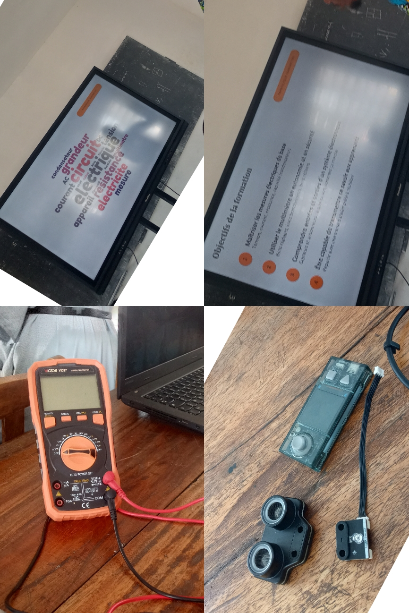
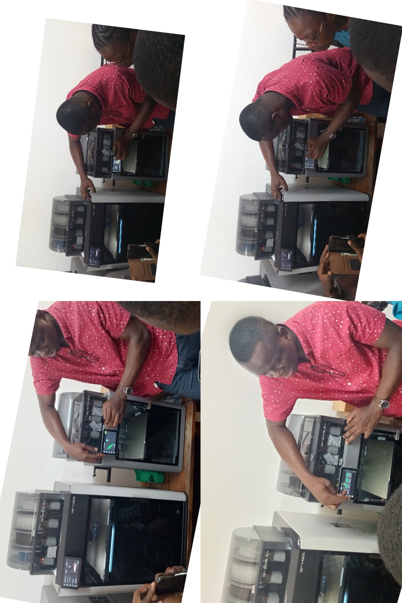
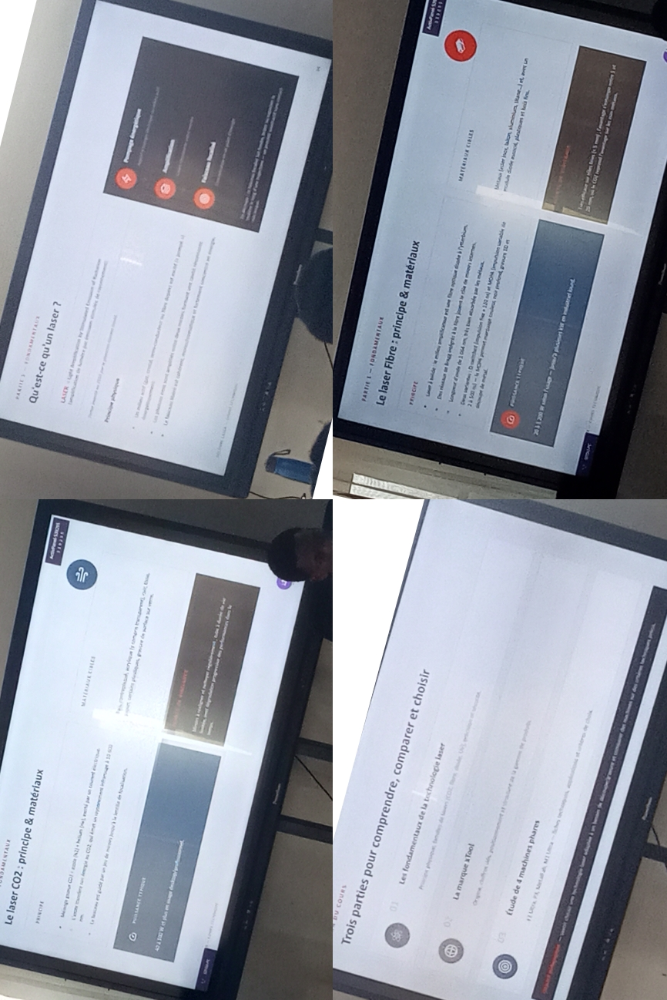

# Journal du 26 Août 2026 (rédigé par: Kokou MEGNASSAN)

## Fait aujourd'hui

- Mise en place 
- Information sur le programme du jour.
- 04 Modules reparties en 04 grands groupes de 25 personnes:
> *1-Electronique-Electricité*  
> *2-Impression 3D*  
> *3-Projet de chaque groupe de 04 personnes*   
> *4-Découpe Laser*

## Appris

### 1- Electronique-Electricité

- **Les Bases de l'électronique dans les FabLabs**
> *-Les grandeurs électriques*  
> *-Les symboles de base de quelques composants électronique*  
> *-Les entrées et les sorties en électronique*  

### 2- Impression 3D

- **Principes Généraux à l'impression 3D**
> *-Comprendre la fabrication additive*  
> *-Maîtriser la technologie FDM/FFF*  
> *-Les trois logiques de fabrication* : Additive → Soustractive → Traditionnelle

### 3- Brainstorming sur les projets 

- **Pourqoui parle-t-on d'un Projet ?**
> *-Chaque groupe doit choisir un projet à réaliser*  
> *-Pour réaliser un projet il faut :*           
  Identifier le problème → Chercher la cause → Apporter une solution → Anticiper les conséquences

### 4- Découpe Laser 
- **Qu'est-ce qu'un Laser ?**
> *-Les fondamentaux de la technologie Laser*  
> *-La Marque XTool*  
> *-Etude de 04 Machines phares*  
> *-Installation et utilisation de XTool*

## Raté, puis corrigé
- Néant

## Décidé
- Néant 

## À faire demain
- **continuité sur:**
> *-Electronique-Electricité*  
> *-Impression sur Imprimante 3D*  
> *-Découpe Laser*