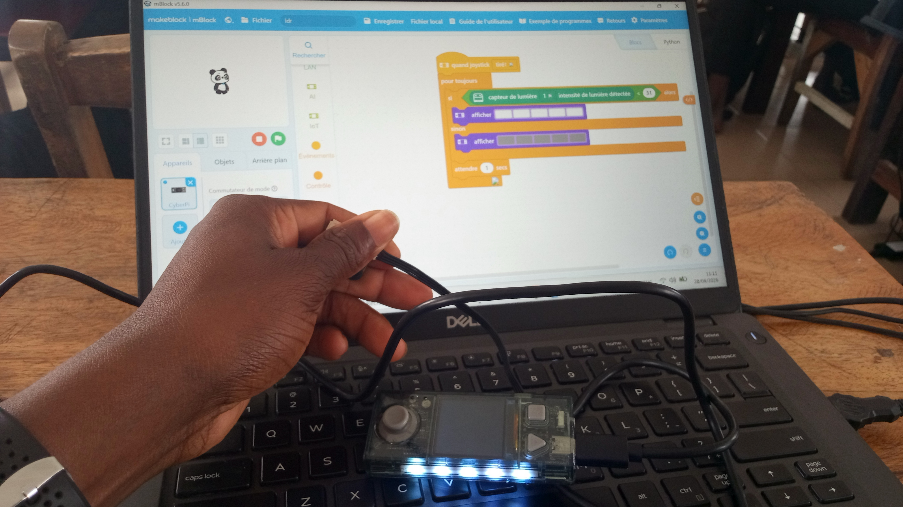
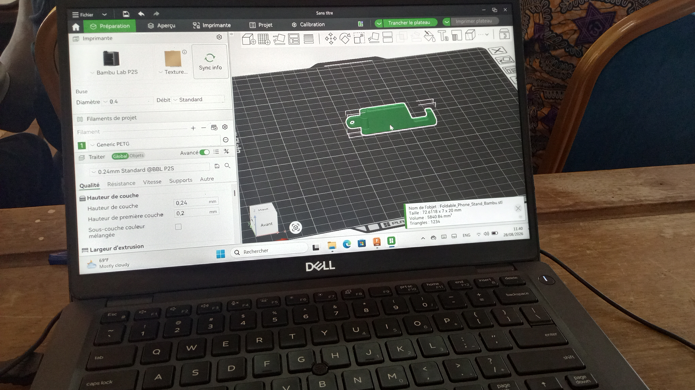
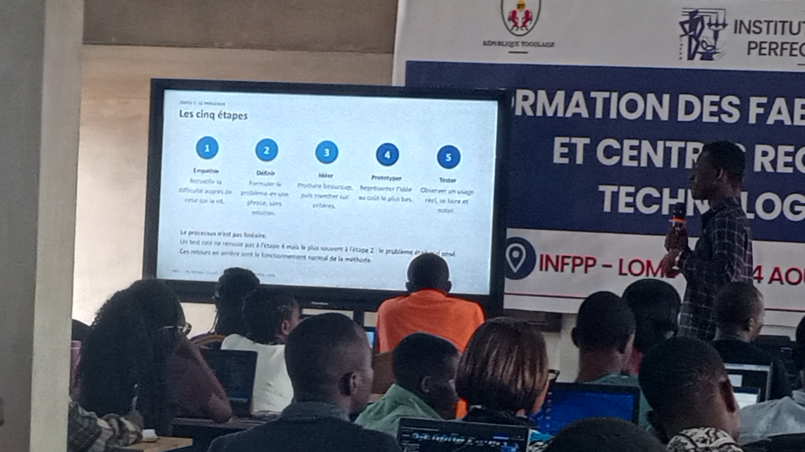

# Journal — Vendredi 28 août 2026 (rédigé par : Kokou MEGNASSAN)

## Fait aujourd'hui

- **Atelier: ElectroniqAue-Electricité :**

> -*Programmation de l'allumage automatique des LED gràce au capteur de lumière :*

> -*Programmation de l'allumage automatique des LED gràce au capteur de lumière à une intensité détectée:*

- **Atelier: Impression 3D :**

> -*Copie du fichier: **foldable-phone-stand-bambu***

> -*Impression d'une pièce copié, sur l'imprimante choisie:* 

- **Atelier: Découpe Laser :**

> -*Suite de la créaction de la carte de visite*

> -*Découpage de la carte sur la Découpe Laser*

- **Présentation du module nommé :** DESIGN THINKNG et LA METHODE SPIRALE

## Appris

- *La programmation de l'allumage autommatique des LED gràce au capteur de lumière à une intensité détectée se fait étape par étape sur le logiciel mBlock et connecté à CyberPi-Light Sensor*

- *L'impression des pièces sur l'imprimante se fait en plusieurs étapes:*

> Sélctionner la pièce sur le plateau →  Pivoter la pièce →  Choisir le filament   → Ajouter du support → Trancher le plateau

- *Les cinq étapes de réalisation d'un projet : Design Thinking et Methode Spirale;*
> Empathie →  Définir → Idéer → Prototyper → Tester ( le pocessus n'est pas linéaire)

## Raté, puis corrigé

- *La programmation de l'allumage autommatique des LED gràce au capteur de lumière se fait étape par étape - Chaque étape est scrupuleusemet respeté*

- *L'impression sur l'imprimante 3D n'est pas fait à cause de l'insuffisance du temps*

## Décidé

- *Utliser une valeur de température inférierure à 31, lorqu'il fait bien sombre pour économiser l'énergie*

- *Faire le choix de l'imprimante et de filament pour avoir une bonne impression adaptée*

- *Suggérer une proposition de heures de cours et de rotation de chaque groupe dans chaque atelier*

## À faire demain

- *Chaque groupe fera suffisament du temps dans de différent atelier*
- *Présentation et Attribution des projets*
- *Jalon 01 : Brainstorming sur les projets* .
