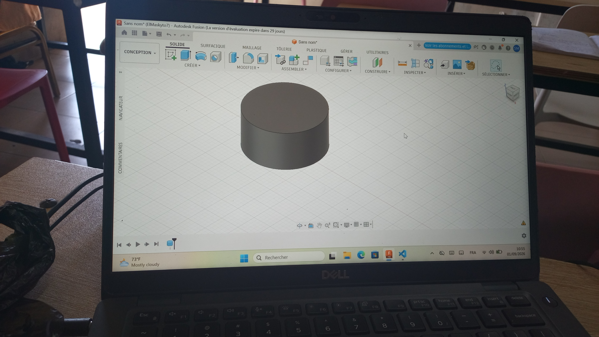
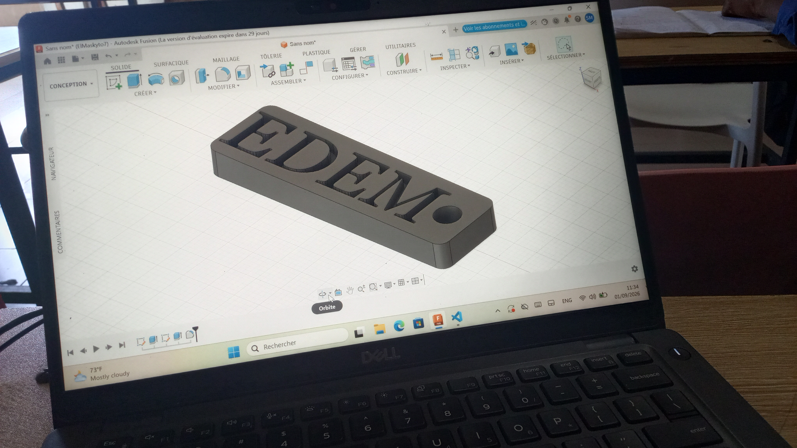
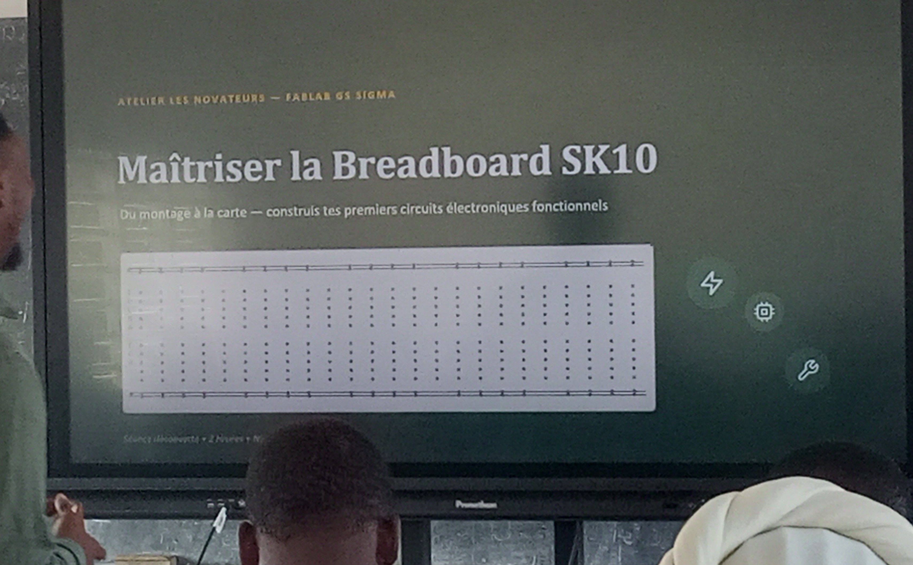
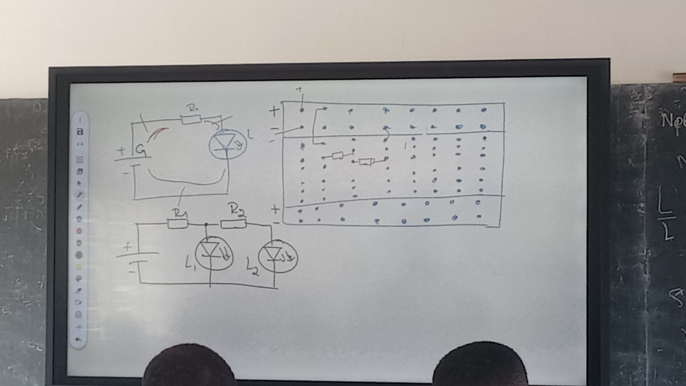
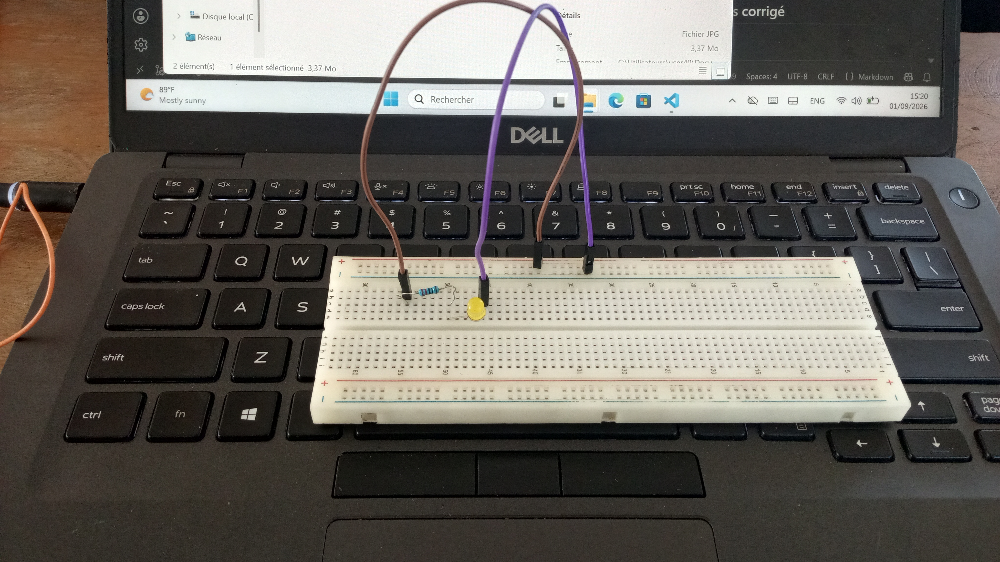

# Journal du Mardi, 01 Septembre 2026 (rédigé par: Kokou MEGNASSAN)

## Fait aujourd'hui

- Mise en place 
- Information sur le programmme
- répartition en 04 groupes par module du jour :
>  *1- Modélisation en 3D sur le logiciel Fusion 360*     
      
>  *2- Electronique avancé*

>  *3- Impression DTF*
## Appris

### 1- Modélisation en 3D

- **Comment utiliser la Fusion 3D pour créer un objet:**
   
>  -*Créer un cylindre avec l'outil Révolution*  
>  -*Créer un cylindre avec l'outil Extrusion*  

>  -*Créer un cylindre avec l'outil automatique "Cylindre"*  

>  -*Créer un cerle dans un rectangle → Créer un Pavé creusé → Bloquer les dimensions du cercle → Créer un nom sur le pavé → exporter pour imprimer*  
   

### 2- Electronique 

- **Maîtriser la Breadboard SK10 :**

> -*Avant de faire un montage il est important de le réaliser sur la Breadboard SK10*  

> -*Schéma du montage d'un circuit sur la Breadboard SK10*

SCHEMA 

MONTAGE

### 3- Découpe Laser
- **Maîtriser l'impression DTF avec xTool**
> -*le matériel nécessaire*  
> -*les différentes etapes à respecter*

> -*Cas pratique : "Impression des images sur T-Shirt"* 

## Raté, puis corrigé

- **Modélisation en 3D**
> -*Dimensionnement du cercle dans le rectangle en pavé raté, puis corrigé*

- **Electronique**
> -*Montage avec plusieurs appareils : conneiction des pôles des appareils ratée,puis corrigée*

## Décidé
- Néant
## À faire demain

- **Consolider le projet** : les matériels appropriés → comment la technologie pour réaliser notre projet 
- **Les Bases de l'algorithme** : la programmation python → comment utiliser la Cyber Pi pour pour programmer les péeiphériques d'entrée et de sortie
