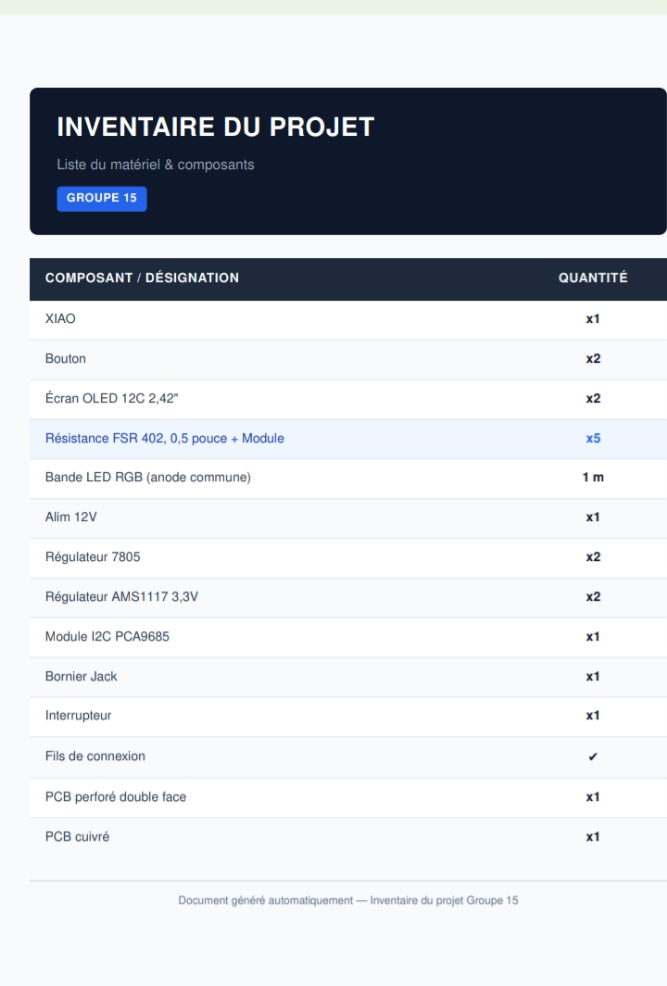
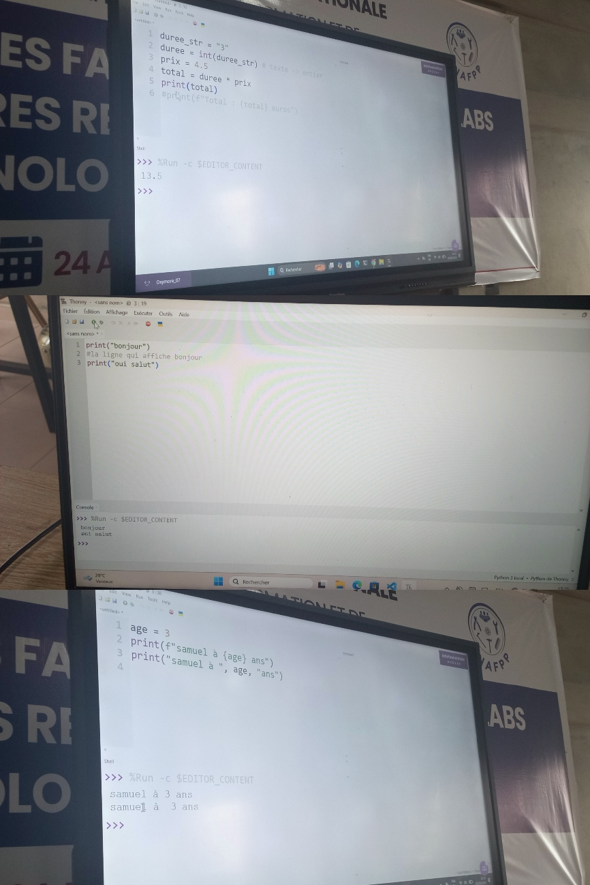

# Journal du Jeudi, 03 Septembre 2026 (rédigé par: Kokou MEGNASSAN)

## Fait aujourd'hui

- Mise en place 
- Information sur le programme du jour 
- répartition en 04 Grand groupes par module du jour :
> *1 -Comsolidation du projet P150, du Groupe 15*  
> *2 -Les Bases de la programmation Python*

## Appris

### 1- Consolidation du Projet P150

- Finalisation du choix des composants 

### 2- Les Bases de la programmation Python
- Pourquoi Python ?  → Qu'est-ce que Python ?
- Python au FabLab : Des cas d'usage concrêt
- Les Variables : Les Boites étiauetées
- L'environement de travail : Thonny → MicroPython
- Cas Pratiques : 

## Raté, puis corrigé
- Néant

## Décidé
- Chaque de charge doit être sous chaque berceau

## À faire demain

- Rôle/fonctionnement des différents composants
- Le Schéma du circuit électronique du project  **P150**